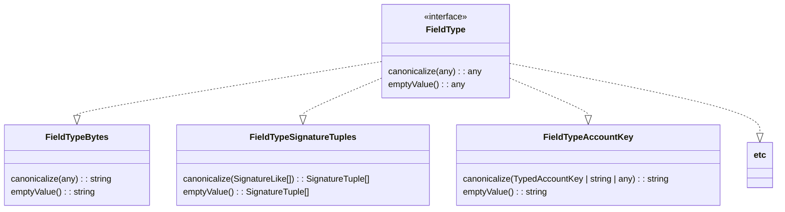
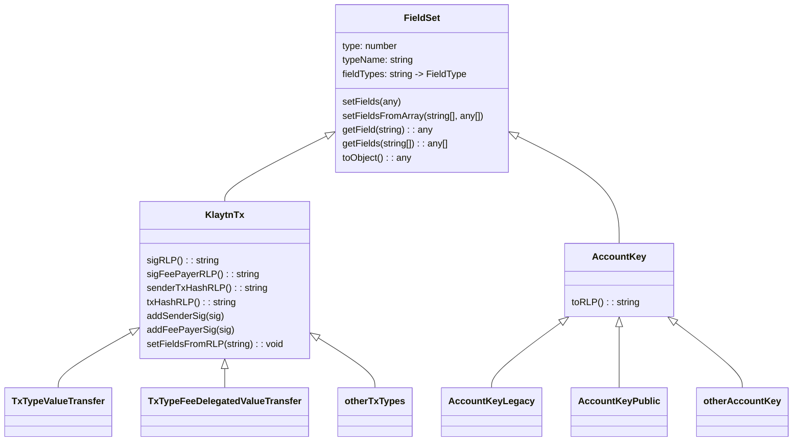
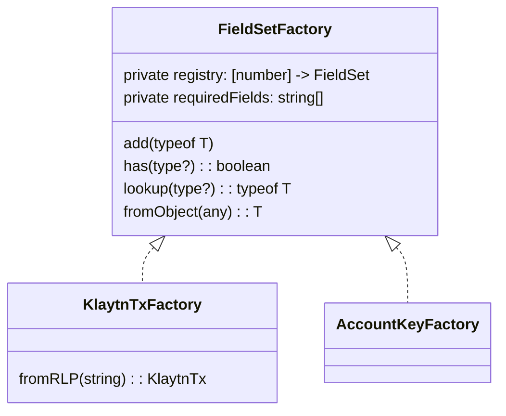
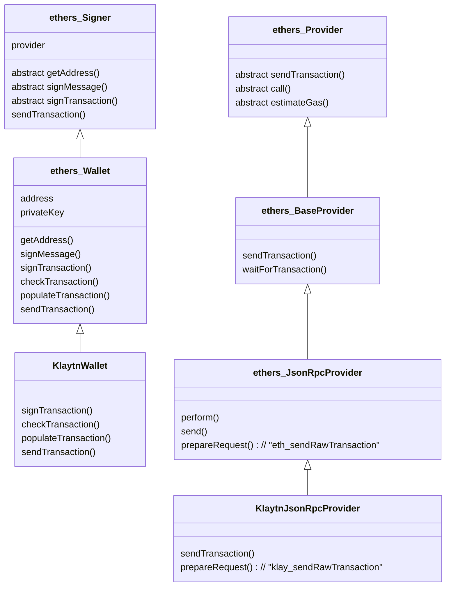

# Ethers.js Extension for Klaytn 

Ethers.js Extension for Klaytn which supports AccountKey, TxTypes, and AccountStore. 

## Run example

```
npm run build
node example/klaytn_tx_ethers.js
```

## Core classes







## ethers extension classes


