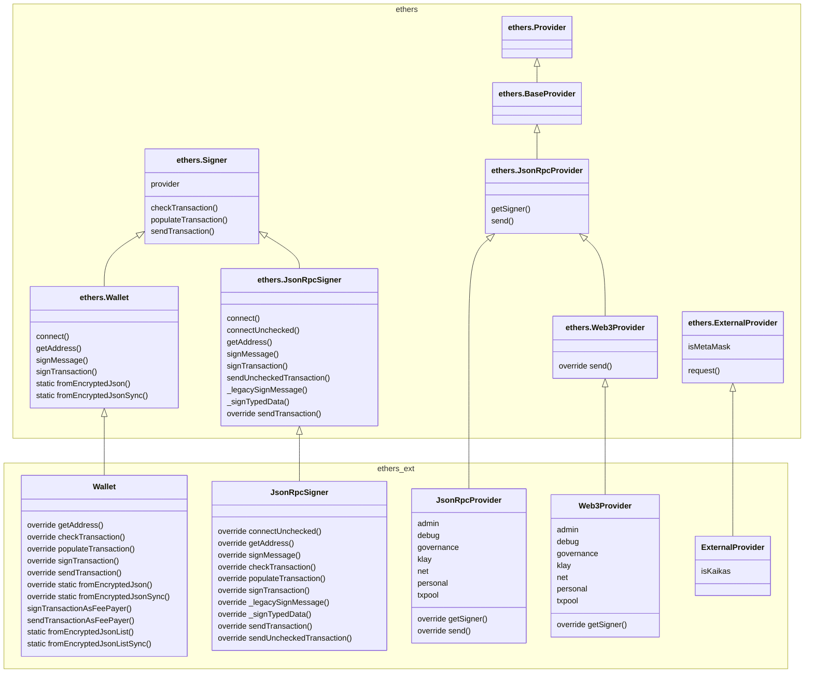

# Ethers.js Extension for Klaytn

Ethers.js Extension for Klaytn offers:

- Drop-in replacement to `ethers.Wallet` that handles both Ethereum and Klaytn transactions
  involving AccountKey and TxTypes.
- Drop-in replacement to `ethers.JsonRpcProvider` that provides Ethereum RPC as well as
  Klaytn-specific RPCs.
- AccountStore to manage Klaytn account keys.

## Install

```
npm install --save @klaytn/ethers-ext
```

## Usage

See [example](./example) and [test](./test).


## Build

- Install dependencies

    ```
    npm install
    ```

- Build the library

    ```
    npm run build
    ```

- Run examples

    ```
    node example/rpc/rpc.js
    ```

## Class extension design


